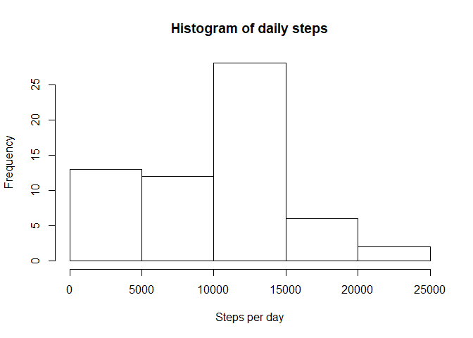
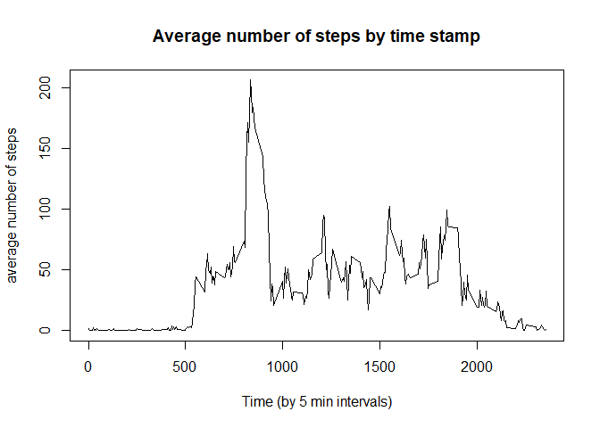
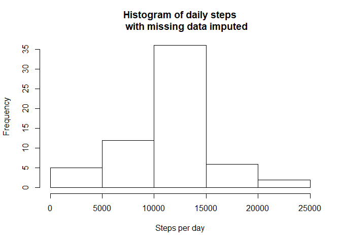
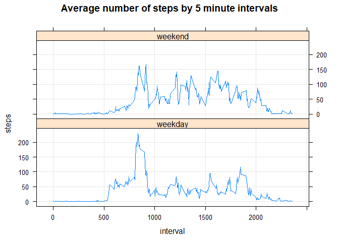

Note: 

- This report is written in a R notebook using Rstudio. 
- Unlike stated in the instructions, figures (graphs) created in this exercise
are not stored in a seperate folder but embedded in the html markdown output file
- To reproduce this notebook (which is not required) the following packages are 
called (you may need Rtools to correctly compile the required packages if not 
allready installed):


```r
library(dplyr)
```

```
## 
## Attaching package: 'dplyr'
```

```
## The following objects are masked from 'package:stats':
## 
##     filter, lag
```

```
## The following objects are masked from 'package:base':
## 
##     intersect, setdiff, setequal, union
```

```r
library(tidyr)
library(lubridate)
```

```
## 
## Attaching package: 'lubridate'
```

```
## The following object is masked from 'package:base':
## 
##     date
```

```r
library(lattice)
library(kableExtra)
```

```
## 
## Attaching package: 'kableExtra'
```

```
## The following object is masked from 'package:dplyr':
## 
##     group_rows
```


The file is downloaded from the [link](https://d396qusza40orc.cloudfront.net/repdata%2Fdata%2Factivity.zip)
given in the assignment.


```r
fileUrl <- "https://d396qusza40orc.cloudfront.net/repdata%2Fdata%2Factivity.zip"
download.file (fileUrl, destfile="activity.zip", method="curl")
```

After downloading, the file needs to be unzipped before loading into R.  


```r
unzip('activity.zip', exdir=".")
```

## Loading and preprocessing the data

The data is loaded into a dataframe using read.csv.


```r
dfa <- read.csv("activity.csv", header=TRUE, stringsAsFactors = FALSE)
str(dfa)  
```

```
## 'data.frame':	17568 obs. of  3 variables:
##  $ steps   : int  NA NA NA NA NA NA NA NA NA NA ...
##  $ date    : chr  "2012-10-01" "2012-10-01" "2012-10-01" "2012-10-01" ...
##  $ interval: int  0 5 10 15 20 25 30 35 40 45 ...
```

```r
summary(dfa)
```

```
##      steps            date              interval     
##  Min.   :  0.00   Length:17568       Min.   :   0.0  
##  1st Qu.:  0.00   Class :character   1st Qu.: 588.8  
##  Median :  0.00   Mode  :character   Median :1177.5  
##  Mean   : 37.38                      Mean   :1177.5  
##  3rd Qu.: 12.00                      3rd Qu.:1766.2  
##  Max.   :806.00                      Max.   :2355.0  
##  NA's   :2304
```

The data is ready to proces and doens't need further processing. 


## What is the mean total number of steps taken per day?
The total number of steps taken is calculated as the sum of 
the 'steps' columns. 


```r
sumsteps <- summarise(dfa, totalsteps=sum(steps, na.rm=TRUE))
sumsteps$totalsteps
```

```
## [1] 570608
```


To review the steps by day, the data is aggregated by day. A histogram is created 
to show the frequencies of steps taken daily.  


```r
stepsbyday <- dfa %>%
        group_by(date) %>%
        summarise(stepsbd=sum(steps, na.rm = TRUE))

hist(stepsbyday$stepsbd, xlab="Steps per day", main="Histogram of daily steps")
```

<!-- -->

The mean  and median  number
of steps taken daily are determined from the dataframe 'stepsbyday' created in 
the previous step. The values are presented in the table below. 


```r
summarydf <- summarise(stepsbyday,
        totalsteps=sum(stepsbd),
        meansteps=mean(stepsbd),
        mediansteps=median(stepsbd))

summarydf
```

```
## # A tibble: 1 x 3
##   totalsteps meansteps mediansteps
##        <int>     <dbl>       <int>
## 1     570608     9354.       10395
```

## What is the average daily activity pattern?

To review the activity pattern by the 5 minute interval averaged by day, 
first the raw data is aggregated to daily averages by the 5 minute intervals. 


```r
stepsby5 <- dfa %>%
        drop_na() %>%
        group_by(interval) %>%
        summarise(meansteps=mean(steps))
head(stepsby5)
```

```
## # A tibble: 6 x 2
##   interval meansteps
##      <int>     <dbl>
## 1        0    1.72  
## 2        5    0.340 
## 3       10    0.132 
## 4       15    0.151 
## 5       20    0.0755
## 6       25    2.09
```

The average daily pattern is shown in a time series plot below. 


```r
plot(stepsby5$interval, stepsby5$meansteps, type="l", xlab="Time (by 5 min intervals)",
     ylab="average number of steps", main="Average number of steps by time stamp")
```

<!-- -->

The maximum amount of steps taken daily on average is found at 
time stamp shown in the value below. 


```r
maxsteps5 <- max(stepsby5$meansteps)
maxinterval <- as.numeric(stepsby5[stepsby5$meansteps==maxsteps5,"interval"])
maxinterval
```

```
## [1] 835
```


##Impute missing values

The summary of the data at the beginning of the document showed that only the 
variable steps contained NAs. The number of NAs in the dataset is shown below


```r
summarise(dfa, naCount=sum(is.na(steps)))
```

```
##   naCount
## 1    2304
```

A simple approach to impute the missing values would be to assign the average value
of steps for the interval timestamp.


```r
dfaImputed <- dfa %>%
        left_join(y=stepsby5, by=c("interval"="interval")) %>%
        mutate(steps = as.double(steps))%>%
        mutate(steps = if_else(!is.na(steps), steps, meansteps))

summary(dfaImputed)
```

```
##      steps            date              interval        meansteps      
##  Min.   :  0.00   Length:17568       Min.   :   0.0   Min.   :  0.000  
##  1st Qu.:  0.00   Class :character   1st Qu.: 588.8   1st Qu.:  2.486  
##  Median :  0.00   Mode  :character   Median :1177.5   Median : 34.113  
##  Mean   : 37.38                      Mean   :1177.5   Mean   : 37.383  
##  3rd Qu.: 27.00                      3rd Qu.:1766.2   3rd Qu.: 52.835  
##  Max.   :806.00                      Max.   :2355.0   Max.   :206.170
```

With the new dataset a new histogram can be drawn showing the frequincies of steps 
taken per day.


```r
stepsbydayImputed <- dfaImputed %>%
        group_by(date) %>%
        summarise(stepsbd=sum(steps, na.rm = TRUE))

hist(stepsbydayImputed$stepsbd, xlab="Steps per day", main="Histogram of daily steps
     with missing data imputed")
```

<!-- -->

The imputation clearly affects the pattern of daily steps as does it affects the 
mean and median ammount of steps taken per day, as shown in the table below.


```r
summarydfImputed <- summarise(stepsbydayImputed,
        totalstepsImp=sum(stepsbd),
        meanstepsImp=mean(stepsbd),
        medianstepsImp=median(stepsbd))

summarydfImputed
```

```
## # A tibble: 1 x 3
##   totalstepsImp meanstepsImp medianstepsImp
##           <dbl>        <dbl>          <dbl>
## 1       656738.       10766.         10766.
```

Comparing the raw and the new imputed dataset, the mean increases with 
<span style="     color: red !important;" >1412</span> and 
the median increases with 
<span style="     color: red !important;" >371</span>.

## Are there differences in activity patterns between weekdays and weekends?
To answer the question,  for each date it has to be determined if it is a 
weekday or a weekend day. The function weekdays() is used to create a new variable
called dayoftheweek, which is used to create the variable daytype.


```r
curr_locale <- Sys.getlocale("LC_TIME")
dfaImputedWD <- dfaImputed %>%
    mutate(dayoftheweek = wday(as.Date(date), label=TRUE, abbr=FALSE, locale='us'),
           daytype = as.factor(if_else(dayoftheweek %in% c('Monday', 'Tuesday',
                            'Wednesday', 'Thursday', 'Friday'), 'weekday',
                            'weekend'))) %>%
# To be able to produce the requested graph the data is again grouped and summmarized
    group_by(interval, daytype) %>% 
    summarize(steps=mean(steps))
```

The new dataset is used to plot the mean number of steps taken at each 
5 min. interval during weekdays and weekend days. 


```r
xyplot(steps ~ interval | daytype, data=dfaImputedWD, layout=c(1,2), type=c("g", "l"),
       main="Average number of steps by 5 minute intervals")
```

<!-- -->


